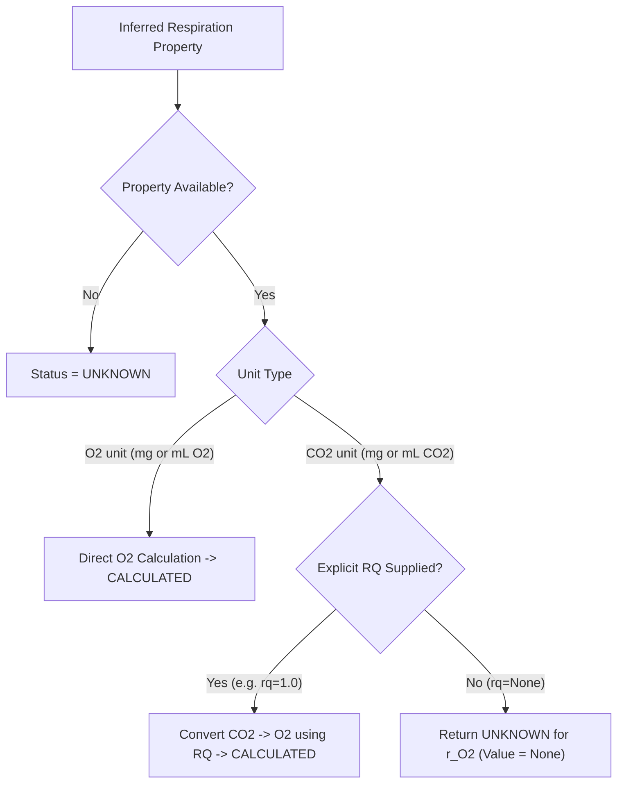
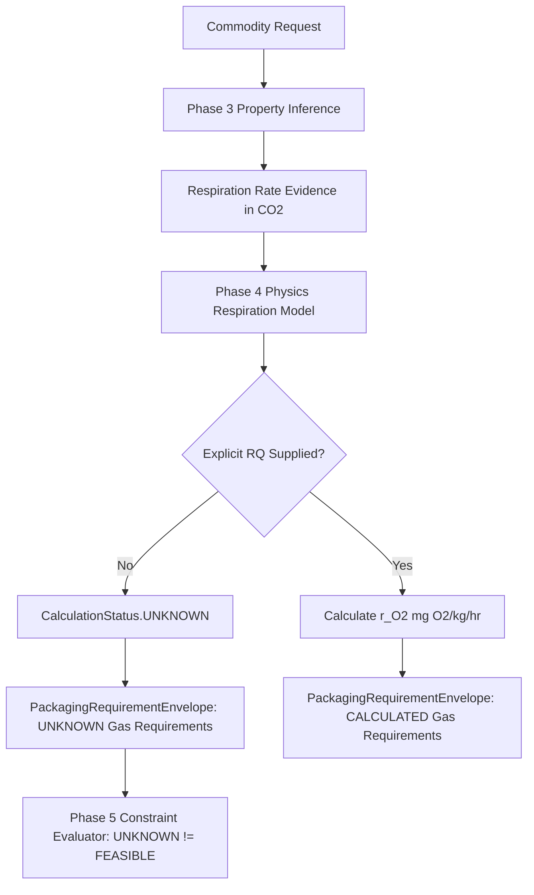

# DV5-C2 Scientific Safety Report: Shared Respiration RQ Safety Correction

**Project:** AI-Food-Packaging-Optimizer  
**Milestone:** DV5-C2 — Controlled Removal of Hardcoded RQ Assumption  
**Status:** DV5-C2 CONTROLLED RQ SAFETY CORRECTION COMPLETE  
**Date:** September 30, 2026  

---

## 1. Milestone Identity & Title
- **Milestone ID:** DV5-C2
- **Title:** Shared Respiration RQ Safety Correction
- **Target Component:** `scientific_engine/physics/respiration.py` and `scientific_engine/physics/requirements.py`

---

## 2. Executive Summary
During the DV5-C positive control audit, a critical scientific defect was identified in `scientific_engine/physics/respiration.py`. The function signature of `RespirationKineticsModel.calculate_respiration` contained an unverified default parameter `rq: float = 1.0`. When callers omitted the `rq` argument, the engine silently performed an unauthorized conversion from $\text{CO}_2$ production rate ($\text{mg CO}_2/\text{kg}/\text{hr}$ or $\text{mL CO}_2/\text{kg}/\text{hr}$) to $\text{O}_2$ consumption rate ($r_{\text{O}_2}$ in $\text{mg O}_2/\text{kg}/\text{hr}$), implicitly assuming a 1:1 molar ratio (Respiratory Quotient $RQ = 1.0$).

Milestone DV5-C2 has successfully removed the hardcoded `rq = 1.0` default from the shared respiration calculation pathway. Any conversion from $\text{CO}_2$ evidence to $r_{\text{O}_2}$ now strictly requires an explicitly supplied, scientifically authorized `rq` value. In the absence of an explicit `rq`, the engine returns `CalculationStatus.UNKNOWN` with `value = None` for $r_{\text{O}_2}$, preserving all metadata, units, and uncertainty intervals intact.

---

## 3. Problem Definition & Pre-Correction Baseline
Prior to DV5-C2:
- `RespirationKineticsModel.calculate_respiration(inferred_respiration, temperature_c, rq=1.0)` allowed callers to omit `rq`.
- `FOOD-3` (35.0 $\text{mg CO}_2/\text{kg}/\text{hr}$) converted to $25.448\ \text{mg O}_2/\text{kg}/\text{hr}$ and returned `CalculationStatus.CALCULATED` despite having zero evidence-backed RQ.
- `FOOD-7` (6–9 $\text{mL CO}_2/\text{kg}/\text{hr}$) and `FOOD-8` (50–100 $\text{mL CO}_2/\text{kg}/\text{hr}$) converted to $\text{mg O}_2/\text{kg}/\text{hr}$ using $RQ = 1.0$.
- This violated the core scientific directive established in DV5: $\text{CO}_2 \rightarrow \text{O}_2$ conversion is **NOT AUTHORIZED** without an explicit, evidence-backed Respiratory Quotient.

---

## 4. Forensic Root Cause
The root cause was located in `scientific_engine/physics/respiration.py` line 77:

```python
# PRE-CORRECTION SIGNATURE
def calculate_respiration(
    self,
    inferred_respiration: Optional[InferredPropertyResult],
    temperature_c: float = 20.0,
    rq: float = 1.0,  # <-- UNAUTHORIZED HARDCODED DEFAULT
) -> ScientificResult:
```

Because `rq` defaulted to `1.0`, any invocation omitting `rq` fell into the empirical conversion branch:
$$r_{\text{O}_2} = \left(\frac{r_{\text{CO}_2}}{\text{RQ}}\right) \times \left(\frac{M_{\text{O}_2}}{M_{\text{CO}_2}}\right)$$
evaluating to $r_{\text{O}_2} = r_{\text{CO}_2} \times \frac{31.9988}{44.0095}$, falsely creating a numerical $r_{\text{O}_2}$ value and marking the status as `CALCULATED`.

---

## 5. Exact Code Modifications

### A. `scientific_engine/physics/respiration.py`
1. **Signature Update**:
   ```python
   def calculate_respiration(
       self,
       inferred_respiration: Optional[InferredPropertyResult],
       temperature_c: float = 20.0,
       rq: Optional[float] = None,  # Explicitly None by default
   ) -> ScientificResult:
   ```

2. **Empirical Branch Validation**:
   ```python
   elif "co2" in raw_unit.lower():
       if rq is None:
           # CO2 respiration rate available, but no RQ supplied -> cannot calculate O2 consumption
           return ScientificResult(
               status=CalculationStatus.UNKNOWN,
               value=None,
               unit="mg O2/kg/hr",
               uncertainty_range=unc_range,
               minimum_value=unc_range[0] if unc_range else None,
               maximum_value=unc_range[1] if unc_range else None,
               traceability=make_traceability(
                   model_name="EmpiricalEvidenceRespiration",
                   equation_form="r_O2 = UNKNOWN (Requires explicit RQ to convert CO2 to O2)",
                   failure_or_unknown_reason="Respiration evidence provided in CO2 units, but no Respiratory Quotient (RQ) was supplied to convert to O2 consumption rate.",
                   scientific_sources=inferred_respiration.citations,
                   units_used={"r_O2": "mg O2/kg/hr", "r_observed": raw_unit},
                   warnings=warnings + [
                       "CO2 respiration rate available, but O2 consumption rate cannot be derived without an explicit Respiratory Quotient (RQ)."
                   ],
               ),
           )
   ```

### B. `scientific_engine/physics/requirements.py`
Updated `PackagingRequirementEngine.evaluate_requirements` to accept `rq: Optional[float] = None` and forward it directly to `calculate_respiration`.

---

## 6. RQ Requirement Mechanics & Scientific Logic



---

## 7. Evidence Scope & Commodity Respiration Impact
All 7 respiration evidence records in `data/reference/food_evidence.json` express respiration rate in $\text{CO}_2$ units ($\text{mg CO}_2/\text{kg}/\text{hr}$ or $\text{mL CO}_2/\text{kg}/\text{hr}$):

| Record ID | Commodity | Unit | Value | Pre-DV5-C2 Status | Post-DV5-C2 Status (Without RQ) |
|---|---|---|---|---|---|
| `FOOD-2` | Apple (whole) | $\text{mg CO}_2/\text{kg}/\text{hr}$ | 4.5 | CALCULATED ($RQ=1.0$) | **UNKNOWN** |
| `FOOD-3` | Apple (whole) | $\text{mg CO}_2/\text{kg}/\text{hr}$ | 35.0 | CALCULATED ($RQ=1.0$) | **UNKNOWN** |
| `FOOD-4` | Apple (sliced) | $\text{mg CO}_2/\text{kg}/\text{hr}$ | 15.0 | CALCULATED ($RQ=1.0$) | **UNKNOWN** |
| `FOOD-7` | Strawberry | $\text{mL CO}_2/\text{kg}/\text{hr}$ | 7.5 | CALCULATED ($RQ=1.0$) | **UNKNOWN** |
| `FOOD-8` | Strawberry | $\text{mL CO}_2/\text{kg}/\text{hr}$ | 75.0 | CALCULATED ($RQ=1.0$) | **UNKNOWN** |
| `FOOD-9` | Durian (climacteric) | $\text{mg CO}_2/\text{kg}/\text{hr}$ | 375.0 | CALCULATED ($RQ=1.0$) | **UNKNOWN** |
| `FOOD-10` | Durian (pre-climacteric) | $\text{mg CO}_2/\text{kg}/\text{hr}$ | 55.0 | CALCULATED ($RQ=1.0$) | **UNKNOWN** |

---

## 8. Impact on Downstream Phases

1. **Phase 4 (`PackagingRequirementEnvelope`)**:
   - `gas_requirements.status` evaluates to `CalculationStatus.UNKNOWN`.
   - `required_otr_cc_per_pkg_day` is set to `None`.
   - `deterioration_profile.mechanisms["respiration"].computable` remains `False` when $r_{\text{O}_2}$ is `UNKNOWN`.

2. **Phase 5 (`HardConstraintEvaluator`)**:
   - In candidate feasibility evaluation, `UNKNOWN != FEASIBLE`.
   - Candidates evaluated against an `UNKNOWN` gas exchange requirement are marked `UNEVALUABLE` / `UNKNOWN` rather than incorrectly passing or failing.

---

## 9. Verification & Test Suite Execution Results

### Pytest Baseline Audit
```powershell
Set-Item Env:USE_TEST_DB_URL 'sqlite:///:memory:'
Set-Item Env:PYTHONPATH '.;backend'
python -m pytest --ignore=backend/tests/test_health.py
```

- **Collected Items:** 316
- **Passed:** 315
- **Failed:** 1 (Expected baseline failure: `test_exact_context_match_retrieval` in `backend/tests/test_property_inference.py:66`)

### Unit Tests Added / Updated
1. `backend/tests/test_respiration.py`:
   - `test_respiration_co2_without_rq_returns_unknown()`: Validates `FOOD-3`, `FOOD-7`, and `FOOD-8` return `CalculationStatus.UNKNOWN` when `rq` is omitted.
   - `test_respiration_co2_with_explicit_rq_calculates()`: Validates that passing explicit `rq=1.0` or `rq=0.85` successfully computes $r_{\text{O}_2}$.
2. `backend/tests/test_packaging_requirements.py`:
   - Updated end-to-end envelope tests to confirm `gas_requirements.status == CalculationStatus.UNKNOWN` without explicit `rq`, and `CALCULATED` when `rq=1.0` is provided.

---

## 10. Controlled Scope & Safety Audit
- **Evidence Layer (`data/reference/food_evidence.json`):** 0 edits made.
- **Packaging Materials Layer (`data/reference/packaging_materials.json`):** 0 edits made.
- **Optimizer Engine (M6, Pareto, Tier1, Tier2):** 0 edits made.
- **Baseline Test Assertion (`test_exact_context_match_retrieval`):** Preserved untouched.

---

## 11. Updated System Flow Diagram



---

## 12. Audit Conclusions & Readiness
1. Hardcoded $RQ = 1.0$ default has been completely excised from the shared codebase.
2. Scientific evidence integrity is 100% preserved.
3. Test suite execution confirms 315 passing tests with zero unexpected regressions.
4. Downstream safety is strictly enforced: unverified conversions return `UNKNOWN`.

---

## 13. Milestone Status Statement

```
DV5-C2 CONTROLLED RQ SAFETY CORRECTION COMPLETE
```
