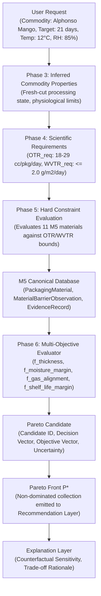

# M6-A: OPTIMIZATION DATA CONTRACT & PARETO INTERFACES

**Project**: AI-Based Intelligent Food Packaging Material Recommendation System  
**Milestone**: M6-A (Input/Output Data Contracts, Pareto Specifications & Traceability)  
**Date**: 2026-09-28  
**Status**: DESIGN COMPLETE — AUDIT READY  

---

## 1. Executive Summary

This document specifies the formal data contracts governing the inputs, outputs, uncertainty representation, evidence eligibility, and traceability interfaces for Phase 6 optimization.

The contracts ensure that:
1. The optimization engine is decoupled from commodity-specific details, consuming strictly typed scientific envelopes.
2. The Pareto output contains complete physical, provenance, and uncertainty metadata required for downstream recommendation and counterfactual explanation.
3. Measurement uncertainty and computational predictions are never collapsed into unverified point estimates.

---

## 2. Optimization Input Data Contract (`OptimizationInputEnvelope`)

The optimizer receives an explicit `OptimizationInputEnvelope` constructed from Phase 4 and Phase 5 outputs. It does **not** query raw user forms or unnormalized strings.

```json
{
  "$schema": "http://json-schema.org/draft-07/schema#",
  "title": "OptimizationInputEnvelope",
  "description": "Formal scientific input contract ingested by the packaging optimization engine.",
  "type": "object",
  "required": [
    "optimization_run_id",
    "commodity",
    "target_shelf_life_days",
    "storage_temperature_c",
    "relative_humidity_percent",
    "package_geometry",
    "packaging_requirement_envelope",
    "filtering_result",
    "eligible_candidate_materials",
    "active_objectives",
    "solver_configuration"
  ],
  "properties": {
    "optimization_run_id": {
      "type": "string",
      "format": "uuid",
      "description": "Unique execution identifier for audit traceability."
    },
    "commodity": {
      "type": "string",
      "description": "Food commodity designation (metadata only; not used for algorithmic branching)."
    },
    "target_shelf_life_days": {
      "type": "integer",
      "minimum": 1,
      "description": "Target preservation horizon requested by stakeholder."
    },
    "storage_temperature_c": {
      "type": "number",
      "description": "Nominal storage temperature in °C."
    },
    "relative_humidity_percent": {
      "type": "number",
      "minimum": 0.0,
      "maximum": 100.0,
      "description": "External ambient relative humidity in %."
    },
    "package_geometry": {
      "type": "object",
      "required": ["surface_area_m2", "headspace_volume_cm3", "product_mass_kg"],
      "properties": {
        "surface_area_m2": { "type": "number", "minimum": 0.001 },
        "headspace_volume_cm3": { "type": "number", "minimum": 0.0 },
        "product_mass_kg": { "type": "number", "minimum": 0.001 }
      }
    },
    "packaging_requirement_envelope": {
      "type": "object",
      "description": "Complete Phase 4 PackagingRequirementEnvelope object (gas, moisture, microbial, shelf-life)."
    },
    "filtering_result": {
      "type": "object",
      "description": "Phase 5 FilteringResult containing FEASIBLE, INFEASIBLE, and UNKNOWN candidate classifications."
    },
    "eligible_candidate_materials": {
      "type": "array",
      "items": { "type": "object" },
      "description": "List of PackagingCandidate objects passing Phase 5 hard constraints."
    },
    "active_objectives": {
      "type": "array",
      "items": {
        "type": "string",
        "enum": ["f_thickness", "f_moisture_margin", "f_gas_alignment", "f_shelf_life_margin"]
      },
      "description": "List of active optimization objectives enabled for this run."
    },
    "solver_configuration": {
      "type": "object",
      "required": ["execution_tier", "max_iterations", "population_size", "tolerance"],
      "properties": {
        "execution_tier": {
          "type": "string",
          "enum": ["LATTICE_LOOKUP", "WARM_START", "DEEP_OPTIMIZATION"]
        },
        "max_iterations": { "type": "integer", "default": 100 },
        "population_size": { "type": "integer", "default": 50 },
        "tolerance": { "type": "number", "default": 1e-4 }
      }
    }
  }
}
```

---

## 3. Pareto Output Data Contract (`ParetoFront` & `ParetoCandidate`)

### Conceptual Schema: `ParetoCandidate`

Each non-dominated solution in the Pareto set is encapsulated in a `ParetoCandidate`:

```json
{
  "$schema": "http://json-schema.org/draft-07/schema#",
  "title": "ParetoCandidate",
  "description": "A single non-dominated packaging design solution lying on the Pareto frontier.",
  "type": "object",
  "required": [
    "pareto_candidate_id",
    "candidate_design",
    "objective_values",
    "constraint_compliance_summary",
    "uncertainty_profile",
    "evidence_tier",
    "traceability",
    "explanation_payload"
  ],
  "properties": {
    "pareto_candidate_id": {
      "type": "string",
      "format": "uuid",
      "description": "Unique identifier for this Pareto solution."
    },
    "candidate_design": {
      "type": "object",
      "description": "Full PackagingCandidate object (material_id, structure, layers, thickness, barriers)."
    },
    "objective_values": {
      "type": "object",
      "required": ["f_thickness_um", "f_moisture_margin", "f_gas_alignment", "f_shelf_life_margin"],
      "properties": {
        "f_thickness_um": {
          "type": "number",
          "description": "Total film thickness in micrometers."
        },
        "f_moisture_margin": {
          "type": "number",
          "description": "Normalized moisture barrier safety headroom [0.0, 1.0]."
        },
        "f_gas_alignment": {
          "type": "number",
          "description": "Dimensionless penalty metric measuring distance to optimal EMAP gas window."
        },
        "f_shelf_life_margin": {
          "type": "number",
          "description": "Normalized shelf life preservation buffer beyond target."
        }
      }
    },
    "constraint_compliance_summary": {
      "type": "object",
      "required": ["all_hard_constraints_satisfied", "passed_constraints", "condition_match"],
      "properties": {
        "all_hard_constraints_satisfied": { "type": "boolean", "const": true },
        "passed_constraints": {
          "type": "array",
          "items": { "type": "string" }
        },
        "condition_match": {
          "type": "string",
          "enum": ["EXACT", "SUPPORTED"]
        }
      }
    },
    "uncertainty_profile": {
      "type": "object",
      "required": ["uncertainty_type", "objective_intervals"],
      "properties": {
        "uncertainty_type": {
          "type": "string",
          "enum": ["DETERMINISTIC_POINT", "BOUNDED_INTERVAL", "QSAR_CONFIDENCE_INTERVAL"]
        },
        "objective_intervals": {
          "type": "object",
          "description": "Upper and lower confidence intervals for each objective if based on range evidence."
        }
      }
    },
    "evidence_tier": {
      "type": "string",
      "enum": ["TIER_1_EMPIRICAL", "TIER_2_PREDICTIVE_QSAR"],
      "description": "Classification of evidence backing this candidate."
    },
    "traceability": {
      "type": "object",
      "required": ["source_ids", "calculation_provenance", "timestamp"],
      "properties": {
        "source_ids": { "type": "array", "items": { "type": "string" } },
        "calculation_provenance": { "type": "string" },
        "timestamp": { "type": "string", "format": "date-time" }
      }
    },
    "explanation_payload": {
      "type": "object",
      "required": ["trade_off_summary", "limiting_barrier", "primary_strength"],
      "properties": {
        "trade_off_summary": {
          "type": "string",
          "description": "Human-readable summary of what this design sacrifices vs. gains."
        },
        "limiting_barrier": {
          "type": "string",
          "description": "The barrier closest to the allowable threshold."
        },
        "primary_strength": {
          "type": "string",
          "description": "The objective in which this candidate excels along the Pareto front."
        }
      }
    }
  }
}
```

### Conceptual Schema: `ParetoFront`

```json
{
  "$schema": "http://json-schema.org/draft-07/schema#",
  "title": "ParetoFront",
  "description": "Complete collection of non-dominated packaging design candidates emitted by Phase 6.",
  "type": "object",
  "required": [
    "optimization_run_id",
    "timestamp",
    "candidate_count",
    "candidates",
    "hypervolume_indicator",
    "solver_metadata"
  ],
  "properties": {
    "optimization_run_id": { "type": "string", "format": "uuid" },
    "timestamp": { "type": "string", "format": "date-time" },
    "candidate_count": { "type": "integer", "minimum": 0 },
    "candidates": {
      "type": "array",
      "items": { "$ref": "#/properties/ParetoCandidate" }
    },
    "hypervolume_indicator": {
      "type": ["number", "null"],
      "description": "Multi-objective convergence metric measuring dominated space."
    },
    "solver_metadata": {
      "type": "object",
      "required": ["algorithm_name", "iterations_completed", "execution_time_ms"],
      "properties": {
        "algorithm_name": { "type": "string" },
        "iterations_completed": { "type": "integer" },
        "execution_time_ms": { "type": "number" },
        "cache_hit": { "type": "boolean" }
      }
    }
  }
}
```

---

## 4. Uncertainty & Dominance Data Contract

### Four-Tier Uncertainty Taxonomy
1. `KNOWN`: Direct point measurement with verified test standard (e.g. ASTM D3985 OTR measurement at $23^\circ\text{C}$).
2. `RANGE`: Interval measurement $[v_{\min}, v_{\max}]$ from experimental literature (e.g., USDA HB66 respiration interval, PolyID film tolerance).
3. `PREDICTED`: Computational estimate from validated QSAR model, accompanied by confidence bounds and standard error (e.g., PolyID QSAR PHA barrier).
4. `UNKNOWN`: Incompatible test conditions, missing barrier parameter, or uncharacterized degradation mechanism.

### Dominance Evaluation Under Interval Uncertainty
When objective values are intervals $[\underline{f}_i(\mathbf{x}), \overline{f}_i(\mathbf{x})]$ rather than single scalars, optimization enforces **Strict Dominance with Uncertainty Bounding**:

$$\mathbf{x}^{(A)} \prec_{\text{interval}} \mathbf{x}^{(B)} \iff \forall i \in \{1, \dots, m\}, \quad \overline{f}_i(\mathbf{x}^{(A)}) \le \underline{f}_i(\mathbf{x}^{(B)}) \quad \land \quad \exists i : \overline{f}_i(\mathbf{x}^{(A)}) < \underline{f}_i(\mathbf{x}^{(B)})$$

If the uncertainty intervals of two candidates overlap in all dimensions, neither candidate can strictly dominate the other. Both candidates are retained in the Pareto front, tagged with overlapping uncertainty warnings for the downstream recommendation layer.

---

## 5. Evidence Eligibility Contract

| Evidence Classification | Verification Status | Eligibility in Phase 6 Optimization | Handling Rules |
| :--- | :--- | :--- | :--- |
| `EXPERIMENTAL_LITERATURE_DATA` | `VERIFIED_EXTRACT` | **Fully Admissible (Tier 1)** | Normal participation in Pareto evaluation; primary recommendation candidates. |
| `EXPERIMENTAL_LITERATURE_DATA` | `PARTIALLY_VERIFIED` | **Fully Admissible (Tier 1)** | Indian postharvest evidence retains explicit `PARTIALLY_VERIFIED` provenance tag; normal Pareto participation. |
| `SOURCE_MEASURED` | `VERIFIED_EXTRACT` | **Fully Admissible (Tier 1)** | Manufacturer technical datasheets with verified ASTM standards; normal Pareto participation. |
| `MODEL_PREDICTED` | `PREDICTIVE_ONLY` | **Provisional / Tagged (Tier 2)** | Admissible to Pareto evaluation, but **must carry mandatory `synthetic_prediction_warning`** and be segregated into `TIER_2_PREDICTIVE_QSAR` in output. |
| Any Classification | Constraint = `UNKNOWN` | **Inadmissible to $\mathcal{P}^*$** | Cannot enter deterministic Pareto front ($\text{UNKNOWN} \ne \text{FEASIBLE}$). May enter separate diagnostic report. |
| Any Classification | Constraint = `INFEASIBLE` | **Disqualified** | Completely excluded from optimization. |

---

## 6. End-to-End Scientific Lineage & Traceability

Every Pareto candidate must retain a verifiable lineage graph tracing back to root evidence:



---

## 7. Counterfactual Query Interface Contract

To enable "what-if" explanations in downstream modules without altering optimization logic, the input contract supports an explicit `CounterfactualRequest`:

```json
{
  "$schema": "http://json-schema.org/draft-07/schema#",
  "title": "CounterfactualRequest",
  "description": "Payload defining a perturbation in scientific requirements or operational conditions.",
  "type": "object",
  "required": ["base_run_id", "perturbations"],
  "properties": {
    "base_run_id": {
      "type": "string",
      "format": "uuid",
      "description": "Reference optimization run from which to evaluate deltas."
    },
    "perturbations": {
      "type": "object",
      "properties": {
        "delta_target_shelf_life_days": { "type": "integer" },
        "delta_storage_temperature_c": { "type": "number" },
        "delta_relative_humidity_percent": { "type": "number" },
        "delta_package_surface_area_m2": { "type": "number" },
        "relaxation_factor_wvtr": { "type": "number", "minimum": 0.5, "maximum": 2.0 }
      }
    }
  }
}
```

The optimizer executes the perturbed envelope and emits a `CounterfactualDeltaReport` comparing baseline Pareto points against perturbed Pareto points, identifying which materials entered or exited the non-dominated set and the exact physical constraint governing the transition.
