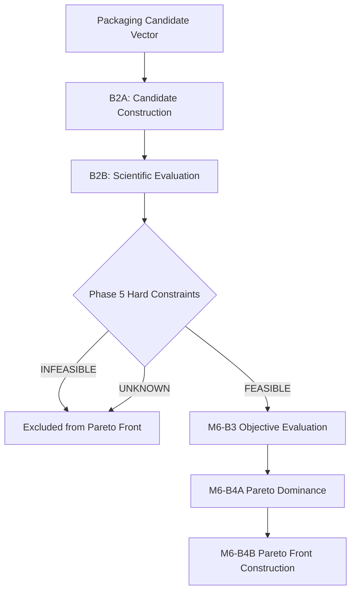
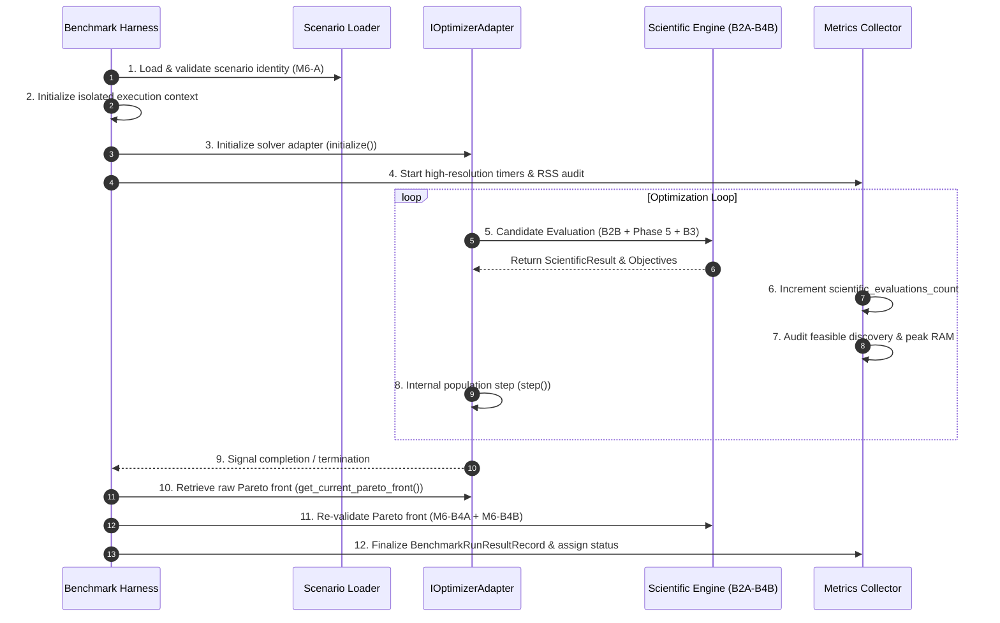

# M7-E3: Optimizer Benchmark Infrastructure & Execution Design

**Project:** AI-Food-Packaging-Optimizer  
**Milestone:** M7-E3 — Optimizer Benchmark Infrastructure & Execution Design  
**Status:** DESIGN ONLY — AUDIT READY  
**Date:** September 30, 2026  

---

## 1. Purpose & Scope

This document establishes the formal **Optimizer Benchmark Infrastructure & Execution Design** for future empirical comparison of multi-objective optimization algorithms within the AI-Food-Packaging-Optimizer project.

Milestone M7-E3 is strictly a **DESIGN-ONLY ARCHITECTURAL SPECIFICATION**. In accordance with project governance:
- **No optimizer algorithm is selected or authorized.**
- **No optimizer algorithm is implemented.**
- **No optimizer algorithms are ranked, scored, or compared.**
- **No empirical benchmark trials are executed.**
- **No synthetic Pareto fronts or benchmark results are generated.**
- **No production code or physics equations are modified.**

The purpose of M7-E3 is to specify the algorithm-neutral execution harness, telemetry interfaces, metric measurement contracts, isolation boundaries, and lifecycle stages required so that future authorized empirical trials (M7-E4) can evaluate candidate algorithms under perfectly identical, scientifically controlled conditions.

---

## 2. Source-of-Truth Documents Inspected

This benchmark design is derived directly from and strictly constrained by the authoritative repository contracts:

1. `docs/scientific_knowledge_foundation.md` — Core scientific domain boundaries and non-fabrication rules.
2. `docs/m6a_optimization_problem_definition.md` — Unalterable 4-part optimization state identity and decision variables.
3. `docs/m6b3_objective_evaluation_report.md` — Authoritative 4-objective M6-B3 contract.
4. `docs/m6b4a_pareto_dominance_report.md` — Pareto dominance definition.
5. `docs/m6b4b_pareto_front_report.md` — Non-dominated Pareto front construction algorithm.
6. `docs/m7a_inverse_design_optimization_execution_contract.md` — Deep inverse-design optimization pipeline contract.
7. `docs/m7b_optimizer_algorithm_authorization_audit.md` — Algorithm authorization framework.
8. `docs/m7c_optimizer_selection_requirements.md` — Requirements for optimizer evaluation.
9. `docs/m7d_optimizer_algorithm_decision_framework.md` — 7-dimension decision framework.
10. `docs/m7e1_optimizer_evaluation_policy.md` — Evaluation unit definitions and policy classifications.
11. `docs/m7e2_optimizer_benchmark_scenario_specification.md` — Benchmark scenario structure and classification taxonomy.
12. `docs/scientific_foundation_freeze.md` — Frozen scientific evidence state certification.

Additionally, code and schema definitions under `scientific_engine/optimization/`, `backend/app/schemas/`, and `backend/tests/` were inspected to ensure complete structural compatibility.

---

## 3. Frozen Optimization Contract

Every benchmark execution under M7-E3 MUST operate strictly on the frozen optimization problem definition established in M6-A and certified in `scientific_foundation_freeze.md`.

### 3.1 Decision Variables
The optimization search space is defined across four decision variables:
1. `material_id`: Primary packaging material identifier.
2. `layer_structure`: Layer ordering, material composition, and structural configuration.
3. `total_thickness_um`: Total film thickness in micrometers ($\mu\text{m}$).
4. `package_geometry`: Target container surface area ($A$) and headspace volume ($V$).

### 3.2 Scientific Evaluation Pipeline
The benchmark infrastructure MUST pass every candidate evaluation through the unalterable 6-stage scientific pipeline without shortcutting, proxying, or bypassing:

$$\text{B2A Candidate Construction} \to \text{B2B Scientific Evaluation} \to \text{Phase 5 Hard Constraints} \to \text{M6-B3 Objective Evaluation} \to \text{M6-B4A Pareto Dominance} \to \text{M6-B4B Pareto Front}$$



### 3.3 Authoritative Objectives (M6-B3)
The benchmark framework MUST evaluate candidate solutions against **EXACTLY AND ONLY** the four frozen M6-B3 objectives:

| Objective Identifier | Mathematical Definition | Optimization Goal | Direction |
|:---|:---|:---|:---|
| `f_thickness` | $f_{\text{thickness}} = \text{total\_thickness\_um}$ | Minimize total material thickness | **MINIMIZE** |
| `f_moisture_margin` | $f_{\text{moisture\_margin}} = \Delta m_{\text{moisture\_capacity}} - \Delta m_{\text{transferred}}$ | Maximize safety margin against moisture degradation | **MAXIMIZE** |
| `f_gas_alignment` | $f_{\text{gas\_alignment}} = \left\lvert \frac{\text{OTR}_{\text{actual}}}{\text{OTR}_{\text{target}}} - 1 \right\rvert + \left\lvert \frac{\text{CO2TR}_{\text{actual}}}{\text{CO2TR}_{\text{target}}} - 1 \right\rvert$ | Minimize deviation from target atmosphere gas rates | **MINIMIZE** |
| `f_shelf_life_margin` | $f_{\text{shelf\_life\_margin}} = t_{\text{calculated\_shelf\_life}} - t_{\text{target\_shelf\_life}}$ | Maximize shelf life surplus beyond requirement | **MAXIMIZE** |

#### Strict Prohibitions:
- `cost_usd_per_m2`, `carbon_footprint_kg_co2_per_kg`, LCA, raw price, or energy metrics **MUST NOT** be introduced into the benchmark pipeline.
- Replacement objectives (`shelf_life_days`, `thickness_mm`) **MUST NOT** be substituted.
- Scalarization (weighted sums, penalty functions, single utility scores) is **STRICTLY PROHIBITED**. Raw multi-objective vectors MUST be evaluated via Pareto dominance.

### 3.4 Hard-Constraint Semantics
The benchmark infrastructure MUST enforce the three-valued Phase 5 constraint semantics:
- **`FEASIBLE`**: Candidate satisfies all hard limits and enters Pareto optimization.
- **`INFEASIBLE`**: Candidate violates one or more hard limits and is excluded from the feasible front.
- **`UNKNOWN`**: Missing evidence or uncalculable physics state. Enforces **$\text{UNKNOWN} \ne \text{FEASIBLE}$**.
- `UNKNOWN` candidates MUST NOT be converted to zero, midpoint values, default numbers, or penalty scores.
- Bounded uncertainty ranges (`RANGE`) MUST remain intervals and MUST NOT be collapsed into point-estimate averages.

---

## 4. Benchmark Scenario Identity

A benchmark scenario represents a frozen, reproducible optimization problem state passed into the benchmark harness.

### 4.1 Canonical 4-Part Identity
In accordance with M6-A and M7-E2, a benchmark scenario identity is defined by the unalterable 4-tuple:

$$\text{Benchmark Scenario Identity} = \left\langle \text{Phase 4 Requirement Envelope}, \; \text{Package Geometry}, \; \text{Active Objective Set}, \; \text{Resolved Eligible Candidate ID Set} \right\rangle$$

```
+-----------------------------------------------------------------------------------+
|                            BENCHMARK SCENARIO IDENTITY                            |
+---------------------------------------------------+-------------------------------+
| 1. Phase 4 Requirement Envelope                   | 2. Package Geometry           |
|    - Gas exchange bounds (OTR/CO2TR)              |    - Surface Area (A > 0)     |
|    - Moisture limits (WVTR / aw)                  |    - Headspace Volume (V > 0) |
|    - Microbial & shelf-life targets               |    - Layer thickness limits   |
+---------------------------------------------------+-------------------------------+
| 3. Active Objective Set                           | 4. Eligible Candidate ID Set  |
|    - f_thickness (MIN)                            |    - Resolved list of valid   |
|    - f_moisture_margin (MAX)                      |      PackagingCandidate IDs   |
|    - f_gas_alignment (MIN)                        |      from search space        |
|    - f_shelf_life_margin (MAX)                    |                               |
+---------------------------------------------------+-------------------------------+
```

### 4.2 Separation of Concerns
The benchmark infrastructure MUST enforce strict separation between four distinct layers:

$$\text{Scenario Identity} \ne \text{Algorithm Configuration} \ne \text{Execution Run Identity} \ne \text{Measured Results}$$

- **Scenario Identity**: Canonical problem definition (hashed per M6-F SHA-256). Contains ZERO algorithm settings, ZERO execution metadata, and ZERO raw food context.
- **Algorithm Configuration**: Hyperparameters (population size, crossover probability, mutation rate, etc.) for a specific solver.
- **Execution Run Identity**: Tuple of $\langle \text{Scenario Identity}, \text{Algorithm ID}, \text{Configuration ID}, \text{Random Seed}, \text{Run ID} \rangle$.
- **Measured Results**: Telemetry collected during and after run execution.

---

## 5. Controlled Experiment Conditions

To guarantee scientifically rigorous, un-biased algorithm comparison, the benchmark harness MUST enforce identical experimental controls across all evaluated algorithms:

| Control Domain | Requirement | Enforcement Mechanism |
|:---|:---|:---|
| **Scenario Definition** | 100% identical Scenario Identity across solvers. | Immutable scenario JSON input. |
| **Search Space** | 100% identical eligible candidate set ($N$). | Resolved Candidate ID set passed to solver adapter. |
| **Evaluation Functions** | Identical scientific code paths for physics & objectives. | Shared `scientific_engine` call pipeline. |
| **Hard Constraints** | Identical Phase 5 validation logic. | Centralized `HardConstraintEvaluator`. |
| **Uncertainty Semantics** | Identical interval treatment and `UNKNOWN` handling. | Centralized `ScientificResult` processing. |
| **Stopping Interface** | Solvers queried via identical termination interface. | Universal `IOptimizerAdapter` loop controller. |
| **Result Validation** | Returned Pareto fronts verified by identical engine. | Independent `M6-B4B` non-domination re-validation. |
| **Telemetry & Timing** | Standardized clock and memory profiling hooks. | Monotonic high-resolution timer & process RSS RAM auditor. |
| **Run Isolation** | Zero state pollution between runs. | Process-isolated or fully reset memory state per run. |

```
EVALUATION BUDGET PARAMETERS (MAX EVALUATIONS, GENERATION CAPS, POPULATION SIZES)
REMAIN: NOT YET AUTHORIZED
```

---

## 6. Algorithm-Neutral Execution Interface

The benchmark infrastructure MUST interact with candidate solver algorithms through a strictly abstract Python interface. Solvers MUST NOT be tightly coupled to benchmark harness code.

### 6.1 Conceptual Adapter Interface Specification

```python
from abc import ABC, abstractmethod
from typing import Dict, Any, List, Optional
from app.schemas.candidate import PackagingCandidate
from app.schemas.optimization import OptimizationState, ParetoFront

class IOptimizerAdapter(ABC):
    """
    Abstract, algorithm-neutral interface for Tier-3 candidate optimizer algorithms.
    """

    @abstractmethod
    def initialize(
        self,
        optimization_state: OptimizationState,
        hyperparameters: Dict[str, Any],
        random_seed: Optional[int] = None,
    ) -> None:
        """Initialize solver state, search space, and random number generator."""
        pass

    @abstractmethod
    def step(self) -> Dict[str, Any]:
        """
        Execute a single iteration/generation step of the optimization algorithm.
        Returns iteration step metadata (e.g. evaluations performed in this step).
        """
        pass

    @abstractmethod
    def get_current_pareto_front(self) -> ParetoFront:
        """Return the current non-dominated Pareto front set discovered by the solver."""
        pass

    @abstractmethod
    def is_terminated(self) -> bool:
        """Check if the solver has reached its internal termination condition."""
        pass

    @abstractmethod
    def get_evaluations_count(self) -> int:
        """Return cumulative number of scientific evaluations performed by the solver."""
        pass
```

### 6.2 Candidate Algorithm Neutrality
Candidate solver algorithms are designated abstractly as **Algorithm A**, **Algorithm B**, **Algorithm C** or via neutral interface names. 

References in prior project documentation to specific solver paradigms (e.g. NSGA-II, MOEA/D, Bayesian Optimization, Surrogate Optimization) are treated strictly as **literature examples / candidate references** and do NOT represent authorized production implementations.

---

## 7. Metric Measurement Contracts (7 M7-D Dimensions)

The benchmark harness MUST measure solver performance across the seven formal dimensions defined in M7-D.

```
WEIGHED BENCHMARK SCORES, SINGLE QUALITY INDICES, AND ALGORITHM RANKINGS
REMAIN: STRICTLY PROHIBITED
```

### 7.1 Dimension A: Scientific / Function Evaluations

- **What is Measured**: Cumulative number of calls to the scientific evaluation pipeline ($B2B + B3$).
- **Measurement Boundary**: Enclosed between `initialize()` completion and final solver termination.
- **Unit**: Count (integer).
- **Data Type**: `uint64`.
- **Measurement Start**: Immediately before the first candidate evaluation call.
- **Measurement End**: At solver return or termination check.
- **Direction**: Lower is better (descriptive efficiency indicator).
- **Raw Storage**: `evaluations_count: int`.
- **Prohibition**: MUST NOT be conflated with solver loop/generation iteration count.

### 7.2 Dimension B: Wall-Clock Time

- **What is Measured**: Total elapsed real time for solver execution.
- **Measurement Boundary**: From `initialize()` call start to final Pareto front extraction end.
- **Unit**: Nanoseconds (`ns`) / Milliseconds (`ms`).
- **Data Type**: `uint64` nanoseconds.
- **Measurement Start**: Monotonic timer call (`time.perf_counter_ns()`) before `initialize()`.
- **Measurement End**: Monotonic timer call after result retrieval.
- **Direction**: Lower is better (descriptive speed indicator).
- **Raw Storage**: `wall_clock_ns: int`.
- **Prohibition**: MUST NOT include scenario loading, scenario validation, or disk serialization time.

### 7.3 Dimension C: Feasible-Solution Discovery

- **What is Measured**: Speed and count required to locate the first `FEASIBLE` solution.
- **Measurement Boundary**: Evaluated per candidate evaluation until a Phase 5 `FEASIBLE` status is returned.
- **Unit**: Evaluations count (`evals`) and Wall-Clock time (`ms`).
- **Data Type**: `Optional[int]` for evals, `Optional[int]` for nanoseconds.
- **Measurement Start**: Solver execution start.
- **Measurement End**: Instance when `Phase5.status == FEASIBLE`.
- **Direction**: Lower is better (descriptive search efficacy indicator).
- **Raw Storage**: `evaluations_to_first_feasible: Optional[int]`, `wall_clock_ns_to_first_feasible: Optional[int]`.
- **Prohibition**: If no feasible solution is found, the value MUST remain `None` and status set to `NO_FEASIBLE_SOLUTION`. Converting "not found" to infinity or maximum evaluations is **STRICTLY PROHIBITED**.

### 7.4 Dimension D: Pareto Coverage

- **What is Measured**: Structural quality of discovered non-dominated front relative to candidate space.
- **Measurement Boundary**: Measured on final validated `ParetoFront` object.
- **Unit**: Dimensionless set properties / Unresolved quality indicator.
- **Data Type**: `object`.
- **Measurement Start**: Post-execution Pareto validation.
- **Measurement End**: Metric computation completion.
- **Direction**: Unresolved.
- **Raw Storage**: `pareto_coverage_status: "BLOCKED_UNAUTHORIZED_REFERENCE_FRONT"`.
- **Prohibition**: Numerical Hypervolume (HV) or Inverted Generational Distance (IGD) calculations are **BLOCKED** until a reference front generation method is authorized.

### 7.5 Dimension E: Repeatability / Variance

- **What is Measured**: Variance of execution outcomes across multiple stochastic runs under identical scenarios.
- **Measurement Boundary**: Computed across a batch of $R$ independent runs with distinct random seeds.
- **Unit**: Statistical dispersion (standard deviation, interquartile range).
- **Data Type**: `Dict[str, float]`.
- **Measurement Start**: Batch experiment aggregation.
- **Measurement End**: Statistical summary computation.
- **Direction**: Lower variance is better (descriptive stability indicator).
- **Raw Storage**: `evaluations_std_dev: float`, `feasible_discovery_rate: float`.
- **Prohibition**: Number of repeated runs $R$ remains `REPEATED-RUN COUNT NOT YET AUTHORIZED`.

### 7.6 Dimension F: Robustness Under Restrictive Constraints

- **What is Measured**: Solver behavior and failure modes when operating on constrained scenarios (Class C, D, E).
- **Measurement Boundary**: Scenario execution outcome under high constraint tightness or missing data.
- **Unit**: Categorical status code.
- **Data Type**: `string` enum.
- **Measurement Start**: Scenario execution start.
- **Measurement End**: Scenario result recording.
- **Direction**: Categorical resilience indicator.
- **Raw Storage**: `robustness_status: Enum("SUCCESS_FEASIBLE_FOUND", "SUCCESS_EMPTY_FRONT_DETECTED", "HANDLED_UNKNOWN_STATE", "SOLVER_FAILED")`.
- **Prohibition**: Solver crashes or unhandled exceptions under tight constraints MUST NOT be converted to empty Pareto fronts.

### 7.7 Dimension G: Peak RAM Usage

- **What is Measured**: Peak Resident Set Size (RSS) memory consumed during solver execution.
- **Measurement Boundary**: Measured continuously or sampled during solver loop.
- **Unit**: Bytes / Megabytes (`MB`).
- **Data Type**: `uint64` bytes.
- **Measurement Start**: Pre-execution memory baseline.
- **Measurement End**: Post-execution memory cleanup.
- **Direction**: Lower is better (descriptive resource footprint indicator).
- **Raw Storage**: `peak_ram_bytes: int`.
- **Prohibition**: Harness infrastructure overhead MUST be subtracted from total process memory to isolate solver RSS.

---

## 8. Feasible-Solution Discovery Contract

The benchmark harness MUST track the discovery of feasible candidates without introducing arbitrary numerical fallbacks:

```python
# Conceptual Feasible Discovery Measurement Record
{
  "first_feasible_found": bool,
  "evaluations_to_first_feasible": Optional[int], # None if first_feasible_found == False
  "wall_clock_ms_to_first_feasible": Optional[float], # None if first_feasible_found == False
  "discovery_status": "FEASIBLE_DISCOVERED" | "NO_FEASIBLE_SOLUTION_EXISTS" | "FEASIBLE_NOT_FOUND_WITHIN_BUDGET"
}
```

- **Rule**: If a solver finishes without finding a feasible candidate, `first_feasible_found` MUST be `False`, and `evaluations_to_first_feasible` MUST remain `None`. Substituting max evaluations or numerical penalties (e.g. `999999`) is **STRICTLY PROHIBITED**.

---

## 9. Pareto Coverage Measurement & Blocker

Pareto coverage evaluation requires a true or reference Pareto front ($\mathcal{PF}^*$) to calculate quality metrics such as Hypervolume (HV), Generational Distance (GD), or Spread ($\Delta$).

```
REFERENCE PARETO FRONT GENERATION METHODOLOGY
STATUS: REFERENCE PARETO FRONT GENERATION METHOD NOT YET AUTHORIZED
```

### Dependency Audit
- **Calculation Status**: **BLOCKED**.
- **Reason**: The project has not authorized a reference front construction procedure (e.g. exhaustive evaluation of candidate space, super-volume union of solver fronts, or mathematical upper bounds).
- **Harness Handling**: The benchmark harness MUST record `pareto_coverage` metrics as `BLOCKED_UNAUTHORIZED_REFERENCE_FRONT` and MUST NOT attempt to output unverified numerical HV scores.

---

## 10. Repeatability Contract

To evaluate solver stability under stochastic variation, the benchmark framework specifies the data schema required for repeated-run tracking:

```
REPEATED-RUN COUNT (R)
STATUS: REPEATED-RUN COUNT NOT YET AUTHORIZED
```

### Required Metadata Captured Per Repeated Run:
1. `scenario_id`: Immutable scenario identity hash.
2. `algorithm_id`: Solver adapter identifier.
3. `configuration_id`: Hyperparameter set hash.
4. `run_sequence_index`: 0-indexed sequence integer ($0 \dots R-1$).
5. `random_seed`: Explicit random seed integer passed to solver.
6. `run_id`: Unique execution identifier UUID.
7. `raw_metrics`: Collected telemetry vectors for dimensions A–G.

---

## 11. Reproducibility Contract

To ensure 100% scientific reproducibility of any benchmark trial, the harness MUST record complete execution provenance:

```json
{
  "reproducibility_provenance": {
    "git_commit_hash": "string",
    "git_repository_clean": bool,
    "python_version": "3.14.0",
    "environment_type": "VIRTUALENV",
    "platform_system": "Windows",
    "platform_release": "11",
    "cpu_architecture": "AMD64",
    "installed_dependency_hashes": {
      "pytest": "9.0.2",
      "pydantic": "2.x"
    },
    "execution_timestamp_utc": "2026-09-30T21:35:00Z"
  }
}
```

---

## 12. Run Isolation Policy

The benchmark harness MUST guarantee complete independence between benchmark runs to prevent memory leakage or state cross-contamination:

1. **Fresh Memory State**: Every optimization run MUST execute in a fresh solver instance with newly allocated internal data structures.
2. **Zero Population Reuse**: Solvers MUST NOT retain population structures, archive vectors, or surrogate weights from previous runs unless warm-starting is explicitly being benchmarked under authorized policy.
3. **Tier-1 Cache Isolation**: Tier-1 exact lookup cache MUST NOT be populated or queried during cold-start optimizer benchmarks.
4. **Tier-2 Warm-Start Isolation**: Tier-2 state selection remains `NOT AUTHORIZED` per M6-K. Tier-2 warm-starting MUST NOT be used in cold-start benchmarks.
5. **Deterministic Physics State**: Scientific evaluation pipeline calls MUST remain stateless and deterministic across runs.

---

## 13. Cold-Start Primacy Policy

All Tier-3 multi-objective optimizer benchmarks under M7-E3 are strictly **COLD-START BENCHMARKS**.

- **Primary Benchmark Purpose**: Evaluate solver search capability starting from zero precomputed memory or cached states.
- **Infrastructure Dependencies Excluded**: Cold-start benchmark execution MUST NOT depend on Redis, disk caches, Tier-2 warm-start databases, or production workload telemetry.
- **Isolation Scope**: Solvers MUST rely strictly on the deep optimization input contract defined in M7-A.

---

## 14. Data Provenance & Scenario Origin Handling

The benchmark framework MUST enforce strict classification of scenario origins per M7-E2:

```
SCENARIO ORIGIN TAXONOMY:
- REAL_SCIENTIFIC_STATE       : Assembled from verified empirical database records (M5 database).
- SYNTHETIC_TEST_SCENARIO     : Synthetic fixture for harness unit tests ONLY.
- REAL_PRODUCTION_WORKLOAD    : Derived from production telemetry (CURRENTLY ABSENT).
- REAL_PILOT_WORKLOAD         : Derived from pilot telemetry (CURRENTLY ABSENT).
- DEMO                        : Educational demonstration scenario.
```

- **Rule**: Real scientific evidence (`REAL_SCIENTIFIC_STATE`) MUST remain un-fabricated. Synthetic fixtures (`SYNTHETIC_TEST_SCENARIO`) are permitted strictly for software unit tests of the benchmark harness and MUST NOT be passed off as empirical scientific evidence or production workload telemetry.

---

## 15. Benchmark Result Contract (JSON Schema Specification)

The conceptual data structure for recording an execution run result is defined below:

```json
{
  "$schema": "https://json-schema.org/draft/2020-12/schema",
  "title": "BenchmarkRunResultRecord",
  "type": "object",
  "required": [
    "run_id",
    "scenario_identity_hash",
    "algorithm_id",
    "configuration_id",
    "random_seed",
    "execution_status",
    "metrics",
    "reproducibility"
  ],
  "properties": {
    "run_id": {"type": "string", "format": "uuid"},
    "scenario_identity_hash": {"type": "string", "pattern": "^[a-f0-9]{64}$"},
    "algorithm_id": {"type": "string"},
    "configuration_id": {"type": "string"},
    "random_seed": {"type": ["integer", "null"]},
    "execution_status": {
      "type": "string",
      "enum": [
        "COMPLETED_SUCCESS",
        "NO_FEASIBLE_SOLUTION_FOUND",
        "SOLVER_CRASHED",
        "TIMEOUT_EXCEEDED",
        "INVALID_CANDIDATE_RETURNED",
        "INVALID_PARETO_FRONT_RETURNED",
        "OUT_OF_MEMORY",
        "UNHANDLED_EXCEPTION"
      ]
    },
    "metrics": {
      "type": "object",
      "required": [
        "scientific_evaluations_count",
        "wall_clock_ns",
        "feasible_discovery",
        "pareto_coverage_status",
        "peak_ram_bytes"
      ],
      "properties": {
        "scientific_evaluations_count": {"type": "integer", "minimum": 0},
        "wall_clock_ns": {"type": "integer", "minimum": 0},
        "feasible_discovery": {
          "type": "object",
          "required": ["first_feasible_found"],
          "properties": {
            "first_feasible_found": {"type": "boolean"},
            "evaluations_to_first_feasible": {"type": ["integer", "null"]},
            "wall_clock_ns_to_first_feasible": {"type": ["integer", "null"]}
          }
        },
        "pareto_coverage_status": {
          "type": "string",
          "enum": ["BLOCKED_UNAUTHORIZED_REFERENCE_FRONT", "COMPUTED"]
        },
        "peak_ram_bytes": {"type": "integer", "minimum": 0}
      }
    },
    "reproducibility": {"type": "object"}
  },
  "additionalProperties": false
}
```

---

## 16. Failure & Invalid Run Semantics

The benchmark framework MUST handle execution anomalies gracefully without converting failures into valid scientific outcomes:

| Anomaly Type | Classification | Harness Action | Metric Treatment |
|:---|:---|:---|:---|
| **Solver Crash** | `SOLVER_CRASHED` | Catch exception, record stack trace. | Evaluations count = count prior to crash; Front = `null`. |
| **Timeout Exceeded** | `TIMEOUT_EXCEEDED` | Halt execution loop gracefully. | Record evaluations up to timeout; extract current front. |
| **Invalid Candidate** | `INVALID_CANDIDATE` | Flag schema violation. | Reject candidate; assign `CalculationStatus.UNKNOWN`. |
| **Invalid Front** | `INVALID_PARETO_FRONT_RETURNED` | Run M6-B4B validator check. | Reject front; set status to `INVALID_PARETO_FRONT_RETURNED`. |
| **Out of Memory** | `OUT_OF_MEMORY` | Catch OOM error in worker process. | Record `peak_ram_bytes`; set status `OUT_OF_MEMORY`. |
| **Calculation UNKNOWN** | `UNKNOWN_EVALUATION` | Propagate `UNKNOWN` per Phase 5. | Candidate assigned `UNKNOWN` feasibility; excluded from front. |

- **Rule**: Failed runs MUST be explicitly recorded as failures and MUST NOT be assigned artificial penalty scores, zero fitness, or dummy Pareto fronts.

---

## 17. Benchmark Execution Lifecycle

The algorithm-neutral benchmark execution harness operates across a 12-step lifecycle:



---

## 18. System Data Flow

```mermaid
flowchart LR
    subgraph Inputs
        Scen[Benchmark Scenario Identity]
        Config[Algorithm Configuration]
        Seed[Random Seed]
    end

    subgraph Benchmark Harness
        Harness[Isolated Execution Harness]
        Adapter[IOptimizerAdapter Interface]
        Collector[Metrics & Telemetry Auditor]
    end

    subgraph Scientific Pipeline (Frozen)
        B2A[B2A Candidate Builder]
        B2B[B2B Physics Engine]
        P5[Phase 5 Hard Constraints]
        B3[M6-B3 Objectives]
        B4A[M6-B4A Dominance]
        B4B[M6-B4B Pareto Front]
    end

    subgraph Output
        Result[BenchmarkRunResultRecord]
    end

    Scen --> Harness
    Config --> Harness
    Seed --> Harness
    Harness --> Adapter
    Adapter <--> Scientific Pipeline
    Adapter --> Collector
    Collector --> Result
```

---

## 19. Unresolved Decisions & Policy Audit

In strict compliance with zero-code design discipline, the following decisions remain explicitly **UNRESOLVED** and **NOT AUTHORIZED**:

1. **Optimizer Algorithm Selection**: No solver algorithm is selected or authorized.
2. **Optimizer Ranking / Scoring**: No ranking formula or weighted multi-metric score is authorized.
3. **Maximum Evaluation Budget**: No numerical function evaluation cap is authorized.
4. **Maximum Generation Count**: No numerical generation iteration limit is authorized.
5. **Population Size Policy**: No population size cap or formula is authorized.
6. **Repeated-Run Count ($R$)**: No numerical repeated-run quota is authorized.
7. **Reference Pareto Front Generation**: Procedure for computing reference Pareto fronts remains `NOT YET AUTHORIZED`.
8. **Pareto Coverage Indicator**: HV / IGD numerical metrics remain `BLOCKED`.
9. **Surrogate Model Authorization**: Machine learning / proxy surrogates remain unauthorized.
10. **Tier-2 Distance Metric**: Warm-start distance/similarity metric remains `NOT AUTHORIZED` per M6-K.
11. **Tier-2 Multi-State Selection**: Tier-2 selection strategy remains unauthorized.
12. **Production Workload Telemetry**: Production workload telemetry remains `ABSENT`.
13. **Numerical Budget Caps**: Stopping criteria numerical values remain unauthorized.
14. **Database Storage System**: Redis / PostgreSQL storage for benchmark results remains un-implemented and unauthorized.

---

## 20. M7-E3 Readiness Assessment & Summary Table

| Infrastructure Item | Status | Lineage / Authority |
|:---|:---|:---|
| **Scenario Identity Standard** | `AUTHORIZED` | M6-A 4-part identity frozen. |
| **Objective Contract** | `AUTHORIZED` | M6-B3 4-objective contract frozen. |
| **Scientific Pipeline** | `AUTHORIZED` | B2A $\to$ B2B $\to$ Phase 5 $\to$ B3 $\to$ B4A $\to$ B4B pipeline frozen. |
| **Constraint Semantics** | `AUTHORIZED` | $\text{UNKNOWN} \ne \text{FEASIBLE}$, Phase 5 frozen. |
| **Metric Measurement Contracts** | `AUTHORIZED` | M7-D 7-dimension measurement boundary specified. |
| **Pareto Coverage Calculation** | `BLOCKED` | `REFERENCE PARETO FRONT GENERATION METHOD NOT YET AUTHORIZED`. |
| **Repeatability Data Schema** | `AUTHORIZED` | Schema specified; `REPEATED-RUN COUNT NOT YET AUTHORIZED`. |
| **Reproducibility Metadata** | `AUTHORIZED` | Provenance metadata schema specified. |
| **Execution Lifecycle** | `AUTHORIZED` | 12-step adapter harness lifecycle specified. |
| **Optimizer Algorithm Selection** | `NOT AUTHORIZED` | Requires empirical trial design (M7-E4). |
| **Tier-2 Warm-Start Selection** | `NOT AUTHORIZED` | Strategy un-authorized per M6-K. |
| **Reference Pareto Methodology** | `NOT AUTHORIZED` | Reference front generation un-authorized. |

---

## 21. Explicit Non-Authorizations

1. Milestone M7-E3 **DOES NOT AUTHORIZE** any specific multi-objective solver algorithm (NSGA-II, MOEA/D, SPEA2, Bayesian Optimization, PSO, etc.).
2. Milestone M7-E3 **DOES NOT AUTHORIZE** any numerical algorithm ranking or performance winner declaration.
3. Milestone M7-E3 **DOES NOT AUTHORIZE** the execution of empirical benchmark trials or generation of synthetic benchmark data.
4. Milestone M7-E3 **DOES NOT AUTHORIZE** numerical values for evaluation budgets, population sizes, or generation caps.
5. Milestone M7-E3 **DOES NOT AUTHORIZE** modification of any frozen physics calculation, scientific evidence record, or unit test file.

---

## 22. Milestone Classification

```
M7-E3 BENCHMARK INFRASTRUCTURE & EXECUTION DESIGN: VERIFIED
```
