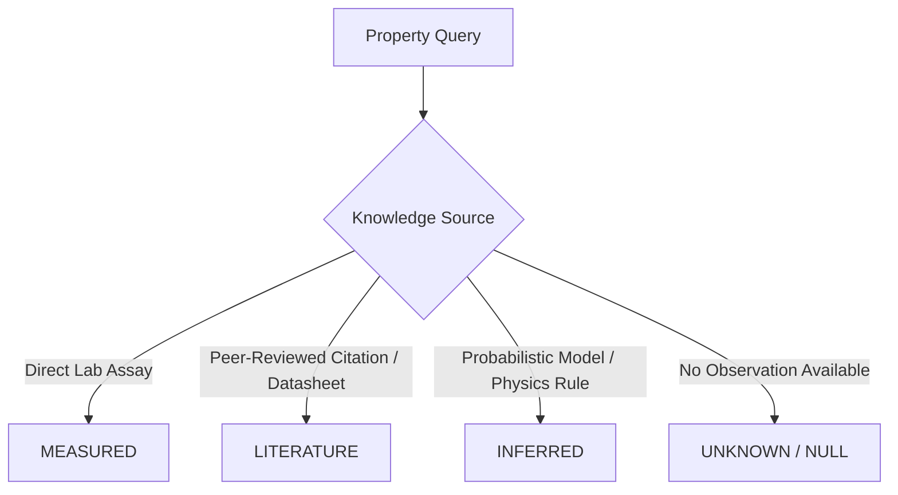

# Scientific Knowledge Foundation (Phase 2)

## 1. Architectural Principles & Scope

The **AI-Based Intelligent Food Packaging Material Recommendation System** is an **inverse-design engineering platform**. It is designed to be completely **commodity-agnostic**, supporting multiple food commodity categories (fruits, vegetables, meats, seafood, dairy, bakery, processed foods).

> **Important Scope Note:** Specific commodities (such as *durian*) serve purely as validation and test cases for complex multi-attribute scientific phenomena. The architecture, data models, and schemas contain zero commodity-specific hardcoding.

### 1.1 Core Engineering Principles

```
RULES FIRST.
PHYSICS FIRST.
AI ONLY WHERE IT ADDS REAL VALUE.
```

- **Inverse-Design Formulation:**
  $$\text{Food Context} + \text{Storage/Transport Conditions} + \text{Target Shelf Life} \longrightarrow \text{Required Packaging Barrier Properties} \longrightarrow \text{Feasible Design Space} \longrightarrow \text{Multi-Objective Pareto Optimization}$$
- **Role of Physics & Deterministic Rules:**
  - Enforce food/package contact safety regulations (FDA 21 CFR, EU 10/2011).
  - Calculate mass transfer, permeation, and respiration balances.
  - Deterministically prune impossible material candidates (e.g., anaerobic fermentation risks, moisture collapse).
- **Role of AI/ML (Future Phases):**
  - Probabilistic property inference for missing/uncertain scientific parameters.
  - Fast surrogate modeling for non-linear mass transfer.
  - Multi-objective inverse search across material, layer, and thickness combinations.
  - Continual learning from post-packaging shelf-life feedback.

---

## 2. Food Evidence Data Model & Context Matrix

Scientific literature does not assign a single static property value (e.g., respiration rate, pH, moisture) to a food commodity. Biological materials exhibit wide phenotypic and physiological variations.

### 2.1 The Context Matrix

Every observation in the food scientific knowledge foundation is indexed against its **environmental and physiological context**:

| Context Dimension | Scientific Rationale | Example Impact |
| :--- | :--- | :--- |
| **Cultivar / Variety** | Genetic differences alter acid/sugar profiles and respiration. | 'Granny Smith' apple (pH 3.2-3.6) vs 'Gala' apple (pH 3.8-4.2). |
| **Product Form** | Mechanical wounding increases respiration and enzymatic activity. | Intact apple ($3\text{--}6\text{ mg CO}_2/\text{kg}\cdot\text{hr}$ at 0°C) vs Fresh-cut slices ($12\text{--}18\text{ mg CO}_2/\text{kg}\cdot\text{hr}$ at 5°C). |
| **Processing State** | Thermal or physical processing alters barrier and microbial risks. | Raw fillet vs Cooked vs Cured salmon. |
| **Maturity / Ripeness** | Climacteric peaks dramatically alter gas exchange. | Mature-green durian ($40\text{--}70\text{ mg CO}_2/\text{kg}\cdot\text{hr}$) vs Ripe climacteric peak ($300\text{--}450\text{ mg CO}_2/\text{kg}\cdot\text{hr}$). |
| **Temperature** | Arrhenius / $Q_{10}$ temperature dependence. | Strawberry respiration at 0°C ($12\text{--}18$) vs 20°C ($100\text{--}200\text{ mg CO}_2/\text{kg}\cdot\text{hr}$). |
| **Relative Humidity** | Drives transpiration and moisture sorption isotherms. | Desiccation risk for leafy greens at $<95\%\text{ RH}$. |
| **Measurement Protocol** | Analytical method determines precision and bias. | Vacuum oven drying vs Karl Fischer titration vs Dewpoint hygrometer. |

### 2.2 Preservation of Conflicting Evidence

> [!IMPORTANT]
> **No Lossy Averaging:** When two peer-reviewed studies report divergent values for the same commodity under identical or differing conditions, **both records are preserved independently**.
> The system does **not** average conflicting observations into a single synthetic number. Epistemic uncertainty is retained for the Phase 2/later probabilistic inference engine.

---

## 3. Packaging Material & Design Knowledge Model

The material knowledge foundation represents monolayer films, coextruded structures, adhesive laminates, foil barriers, paper-based substrates, bio-polymers, coated films, and active packaging systems.

### 3.1 Test Condition Mandate for Barrier Properties

Barrier performance metrics—such as **Oxygen Transmission Rate (OTR)**, **Water Vapor Transmission Rate (WVTR)**, and **$\text{CO}_2$ Transmission Rate ($\text{CO}_2\text{TR}$)**—cannot be stated as isolated numbers. They are strictly conditioned on:
- **Test Temperature** (e.g., $23^\circ\text{C}$ for OTR ASTM D3985; $38^\circ\text{C}$ for WVTR ASTM F1249)
- **Test Relative Humidity** (e.g., dry $0\%\text{ RH}$ vs moist $85\%\text{ RH}$)
  - *Example:* EVOH has an ultra-high oxygen barrier at $0\%\text{ RH}$ ($\text{OTR} \approx 0.4\text{ cc}/\text{m}^2\cdot\text{day}\cdot\text{atm}$), but plasticizes at $85\%\text{ RH}$ ($\text{OTR} > 5.0\text{ cc}/\text{m}^2\cdot\text{day}\cdot\text{atm}$).
- **Standardized Test Method** (e.g., ASTM D3985, ASTM F1249, ISO 15106, ASTM D882).

### 3.2 Material Neutrality

> [!NOTE]
> The material model **never ranks materials universally**. No material is inherently "superior"; suitability depends entirely on the inverse-design constraints of the target food commodity (e.g., high-respiring produce requires breathable films; high-fat seafood requires high oxygen barriers).

---

## 4. Epistemic Property Status Framework

The system maintains four distinct knowledge states across all food and material properties:



- **`measured`**: Direct experimental measurement from a verified laboratory protocol.
- **`literature`**: Published peer-reviewed research, official food database (USDA), or technical datasheet.
- **`inferred`**: Predicted via machine learning surrogate or thermodynamic relation (future phases).
- **`unknown`**: No data available. Represented as `None` / `null`. Never populated with placeholder guesses.

---

## 5. Controlled Vocabularies

The system uses standard enumerations (`app.schemas.vocabularies`):
- **`FoodProperty`**: `moisture_content`, `fat_content`, `ph`, `water_activity`, `respiration_rate`, `ethylene_production`, `oxygen_sensitivity`, `moisture_sensitivity`, `oxidation_sensitivity`, `aroma_volatility`, `microbial_risk`, `temperature_sensitivity`, `shelf_life`, `mechanical_sensitivity`, `co2_sensitivity`, `chilling_injury_threshold`, `freezing_point`.
- **`CommodityCategory`**: `fruit`, `vegetable`, `meat_poultry`, `seafood`, `dairy`, `bakery_cereal`, `confectionery`, `beverage`, `processed_food`, `nuts_seeds`, `other`.
- **`ProcessingState`**: `raw`, `fresh_cut`, `minimally_processed`, `pasteurized`, `sterilized`, `frozen`, `dried`, `fermented`, `cured`, `cooked`, `blanched`.
- **`ProductForm`**: `whole`, `sliced`, `diced`, `shredded`, `puree`, `juice`, `fillet`, `portioned`, `ground`, `powder`, `liquid`, `paste`.
- **`MaturityStage`**: `immature`, `mature_green`, `breaker`, `turning`, `ripe`, `fully_ripe`, `overripe`.
- **`MaterialCategory`**: `mono_polymer`, `coextruded_multilayer`, `laminated_multilayer`, `metallized_film`, `foil_laminate`, `bio_based_polymer`, `biodegradable_polymer`, `paper_fiber_based`, `active_functional`, `coated_film`.
- **`PackagingProperty`**: `oxygen_transmission_rate`, `water_vapor_transmission_rate`, `carbon_dioxide_transmission_rate`, `tensile_strength`, `puncture_resistance`, `seal_strength`, `seal_initiation_temperature`, `transparency`, `max_service_temperature`, `biobased_content`, `recyclability`, `compostability`.
